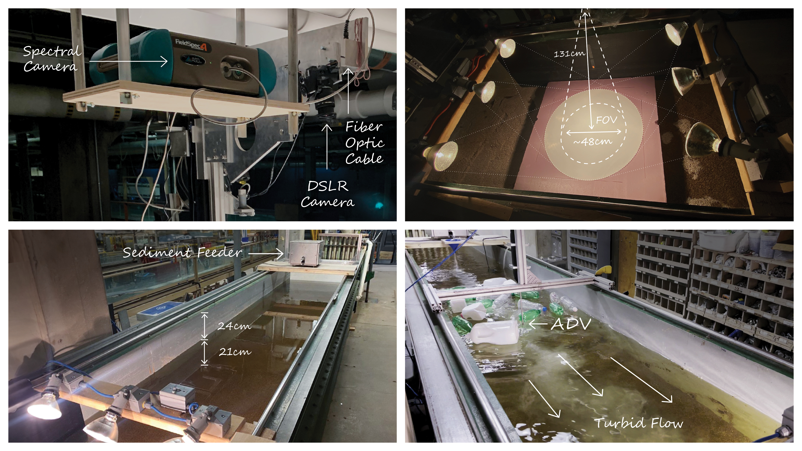
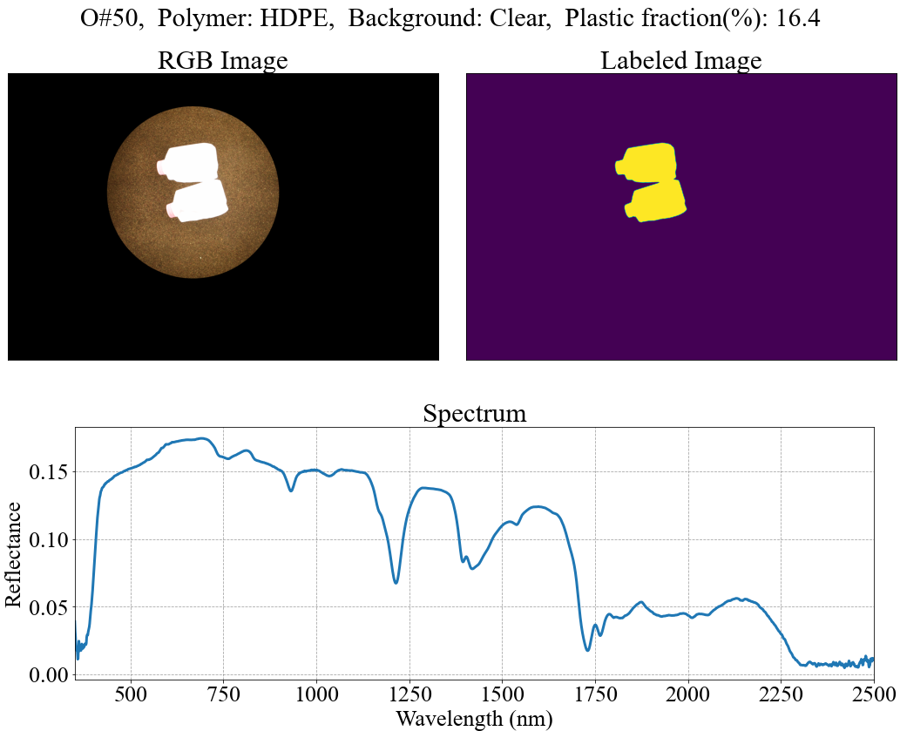

# A Hyperspectral Reflectance Database of Plastic Debris for River Ecosystems

This is a unique hyperspectral reflectance dataset of weathered and virgin floating plastic debris with different sizes and types under controlled laboratory conditions. 
The data are collected through an acquisition system over a hydraulic flume to capture the random effects of sub-grid scale fractions of the plastic debris on diffused light reflectance. 
Hyperspectral measurements stored in Network Common Data Form include (a) hyperspectral reflectance values from ultraviolet (UV, 350 nm) to the shortwave infrared (SWIR, 2500 nm) at spectral resolution between 3 to 12 nm over a field of view (FOV) of 8-degree across all measurements, (b) images used to determine the fractional abundance of the debris within the FOV, and (d) details of hydraulic conditions of background water (i.e., clean, turbid, foamy), sediment concentration, and debris characteristics. 
This dataset serves as a valuable resource for analyzing the spectral characteristics of various plastic litter types and identifying key wavebands containing spectral signatures of floating freshwater plastic debris.

 

To download the NETCDF files go to [https://doi.org/10.5281/zenodo.5151941.](https://zenodo.org/records/10723548)

### Dataset Structure

Each NETCDF file follows the labeling structure in the following format:
	    
	    ├─ ID                                           # Observation Number
	    └─├─ Polymer                                    # Polymer Type
	      └─├─ Background                               # Background setting  
		└─├─Sediment Concentration                  # Sediment concentration
		  └─├─Debris Color                          # Debris color  
		    └─├─Plastic Fraction                    # Percentage of plastic fraction
		      └──Quality Flag                       # Quality flag (1: lowest, 5: highest)
			                                

Python and MATLAB code have been provided for conducting general statistical analysis of the dataset, opening NETCDF files, visualizing the spectrum, RGB image, and labeled image. Additionally, an XGBoost classifier has been implemented for debris classification using Python.

### For using python code, please install the following library:

- numpy==1.20.3
- matplotlib
- scikit-learn
- pandas
- glob==0.7
- matplotlib
- tabulate==0.9.0
- pyarrow==15.0.0

Acknowledgment: The funding support from the Legislative-Citizen Commission on Minnesota Resources (LCCMR, M.L.2021 E812RSM) is greatly acknowledged
